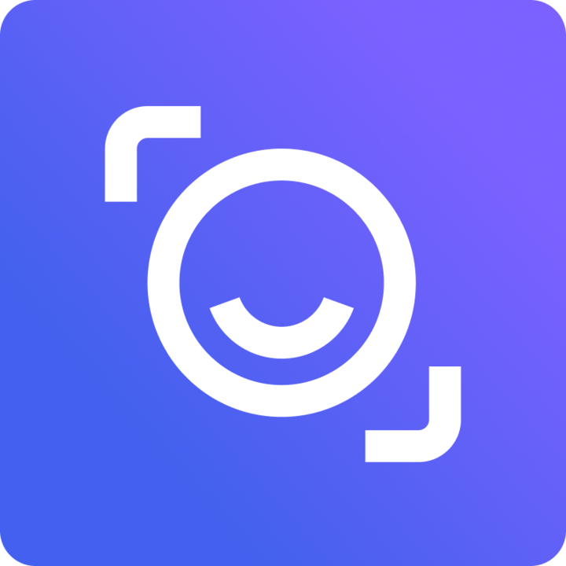

This is where I'm putting some more personal thoughts on my work experience, while also
listing older items that may no longer be relevent. If you actually want to see what
makes me hirable, check out my [resume](/resume.pdf)

## Read AI
*Full-Stack Software Engineer (Experiences) | November 2025 - Present*
- I'm joining Read AI's Experiences team, working on a Desktop app which will help synthesize information from various sources (calls, messaging apps, e-mail, Calendar) to help users cut redundant meetings, and prioritize work items

<!-- programming_languages: Rust, React -->

## Meta Platforms, Inc.
*Senior Software Engineer (Mobile Networking Services) | October 2023 - March 2025*
- Worked on Meta's client-side networking middleware, mostly deployed in Mobile Apps
- Most of my work was unifying logic from app-specific code into a shared library, allowing for per-app customization while centralizing logic. E.g.
    - Refactored logging logic into one logger
    - Centralized where HTTP Priorities are determined, while allowing per-app control via DI
- Enabled various features to reduce startup time in case of bad networks
- Contributed to moxygen, Meta's implementation of IETF's Media over Quic protocol

## Meta Platforms, Inc.
*Senior Software Engineer (Conveyor) | July 2021 - October 2023*
- Developed features and enabled migration of Meta's Continuous Deployment Platform, Conveyor from V2 -> V3. (Details in my [Systems @ Scale](https://www.youtube.com/watch?v=SFxeWZDPU3o) talk and accopanying [blog post]())
- My personal focus was on bringing usability to the forefront of the product:  
    - Created a DSL for new configurations in Conveyor3, focusing on simplicity for most users with escape-hatches for power users
    - Held user interviews to understand UI && documentation pains, leading to creating more readable and intuitive interfaces
    - Integrated Conveyor3 with company-wide metadata services, for easy insight into Conveyor's internal workings
    - Led the migration team for the last 70% (over 28,000 deployment pipelines!) of Conveyors from Conveyor2 -> Conveyor3, finishing a migration (which, if you've ever been in Big Tech, almost never happens)
- I also did feature and migration parity development
- I collaborated with the Security team on multiple red-team identified bad-actor vulnerabilities, where anyone could compromise the system and gain control to all services at Meta
- My other focus was mainly on finding out new ways to use Rust, and bringing our team, which was relatively Green to the language, to use better idioms

## Facebook, Inc.
*Software Engineer Intern (Payments Infrastructure) | June 2020 - August 2020*
- Developed an internal tool which, through code-analysis, enabled engineers to migrate 
Payments API in Hack (PHP), C++, Python
- Started work on a finite-state-machine to visualize payments transactions

## Datto, Inc.
*Software Engineer Intern (Routers & Switches) | January 2020 - June 2020*

#### What I Did
- Was developing a series of maintained routers & switches for MSPs, to integrate with Datto Portal
    - Contributed to feature development (plumbing operations from web interface -> api -> DB -> hardware)
    - Scrubbed (inherited) UI of XSS vulnerabilities
    - Created developer Docker environment to speed up onboarding

#### Thoughts, Takeaways
To be honest, at first I was a bit hesitant on taking Datto. I had some friends who were
here for their first co-op, and thought that "I could do better!"

Turns out, Datto was one of the best places to work for me. So, thanks to Eddie Shen for the
referral here (and for other referrals... we can tackle that later. But Eddie turned out to
be instrumental in much of my early career development). It had that balance of being a 
company growing

## Akamai Technologies, Inc. 
*Web Support Intern | January 2019 - May 2019*

#### What I Did
- Assisted in troubleshooting network issues on Akamai Intelligent Edge Platforms, such as:
    - Edge -> Edge slowdown
    - Mis-configurations
    - Edge connection issues
- With a non-coding team, I also scripted tools to:
    - delete old files from engineers' dev-servers
    - create a new learning system for new Support Techs, to gameify learning

#### Thoughts, Takeaways
When you ask me what I thought about Akamai, I generally make some humorous "jokes" about
how my time there was boring, or made me want to say "Aka-bye." I do thank my time here for
giving me some rock-solid fundamentals when it comes to understanding how Networking works
at a deeper level. While I did do some light scripting at work, none of it was very
relevant to a SWE career. Most of my time was wrestling with grep and awk to make some 
datasets that ended up not even being used by the real support engineers.

I do thank my time here though for helping me understand how important it is to have this 
layer of support for a product though, and what it's like when a tool "made for developers"
is just unleashed to the masses. Careful thought needs to be put into UIs and APIs to help
guide users into making correct decisions for their edge-configurations.

My time here, much of it being free, also enabled me to spend a lot of time tinkering with
my Emacs configuration, and to also work on SearchNEU, which opened many doors.
It also opened the door to the first real coding I've done in my life. Without having the
time here, I wouldn't've grown into the engineer I became today. So thanks, Akamai!

## Northeastern University
*Tutor for Fundamentals of Computer Science 1 (CS 2500) | 2018 - 2020*

#### What I Did
- Tutored for CS2500, which used to be based on [How To Design Programs](https://htdp.org/)
    - Students were guided through a series of Racket-based languages
    - Taught a framework for approaching problems through a contract-based Design Recip
- Personal responsibilities included:
    - Maintaining/Developing Northeastern's remote office hours website
    - Holding office hours
    - Grading homeworks/exams
    - Answering student questions on Piazza (an online forum)

#### Thoughts, Takeaways
It's often said the best way to learn something is to teach it. I **need** to thank Rebecca 
here for taking a chance on me in 2018 to teach this course when I wasn't necessarily the 
most brushed-up candidate on the material. While the design recipe made some sense to me as
an overwhelmed Freshmen, getting the chance to teach this material to future students also
ensured that I understood what the class taught. Even now, I rely on the information I
gained here for much of my current coding style. And I thank this class for teaching me how
to **think** about problems; it's allowed me to get back into algorithmic style questions
relatively easily, allowing me to rely on fundamentals for naive LeetCode-style questions
with ease. 

One of the best parts of this class is reconnecting with old students. I've had many tell me,
whether on LinkedIn or in passing on the street, that they credit part of their current
success to my teaching, which humbles me greatly. Teaching is really a reward in and of
itself, and I'm honoured to have helped multiple students unlock an understanding of the
fundamentals of computing.

Northeastern's recently changed the curriculum to instead use Pyret, a language based on
data-definitions, and then migrating students to use Python. While I understand where this
change comes from, I don't think it will produce a better crop of students. Much of this
reaction seems spurred by Co-Ops no longer being as high quality as before. I posit that
this might be due to Northeastern's CS program ballooning, and educators not teaching
the Fundamentals with the same care. But what do I know? I'm not an education researcher.

I don't think this is necessarily a net-negative, Pyret's based on learnings from CS2500.
But the change to use Python is a scary one that I hope the school is ready for. At the very
least... this will make using ChatGPT to get ahead in classes easier.